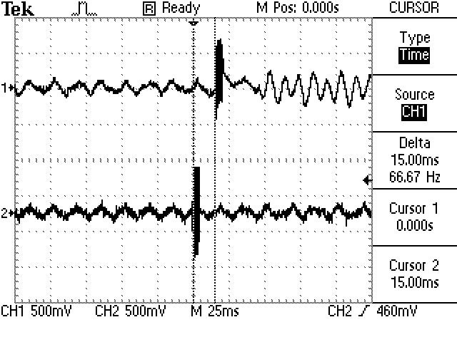

hpcap version 0.1, Copyright (C) 2008 Jeff Otterson <otterson@mindspring.com>
28 November 2008

DESCRIPTION
-----------

  This software allows you to attach various devices that emit screen dumps
in PCL5 to your linux box, and capture the screen dump in a format that
may actually be useful.  I wrote this to use with my HP 8921 cell site test
set, but it also works with my Tek TDS 210 Oscilloscope.

  The test equipment should be set up to send it's screen prints to a
HP laserjet configuered on the serial port.  The program searches for the
PCL5 data in the serial stream, and captures an image.

  The program creates a PBM file as output, then calls the 'convert' utility
(from ImageMagick) to create a gif.  Call me lazy.  I did not want to write
my own gif output function, or bother to link some library to do that.
Should you decide to put that in, then I'd love to have a copy.  (PBM is the
least efficient storage method possible, using about 2 bytes per pixel,
but disk space is cheap and my time is precious -- so there!)

  This program is derived from my tdsdump program of 1998, but where tdsdump
just forwarded the 'scope's output to the printer, this program actually
captures the bitmap.  Yee-haw.

EXAMPLES
--------

LATEST VERSION
--------------

This software has not yet been released, so the latest version is only
available from the author.  Contact Jeff at otterson@yahoo.com for the
latest sources.

WARRANTY
--------

hpcap comes with ABSOLUTELY NO WARRANTY; See COPYING for details.
This is free software, and you are welcome to redistribute it
under certain conditions; See COPYING for details.
You should have received a copy of the GNU General Public License
along with this program; if not, write to the Free Software
Foundation, Inc., 59 Temple Place - Suite 330, Boston, MA 02111-1307, USA

USAGE
------
        Optional parameters are :
		 -t input tty           default /dev/ttyS0
		 -l lpr command         default lpr -r %s, does nothing!
		 -v print version and exit
		 -h this help screen

NOTES
-----

  Use the serial port on the HP8921 to output data.  Wire it to your Linux
box's serial input per the HP documentation.  You can use a regular RJ-11 connector here, you don't need the outer two pins that are on the RJ-12.

  There is NO FLOW CONTROL!

  For the TDS210, set it up like this:

  Utility->Options->Hard Copy Setup
    Layout: either LANDSCAPE or PORTRAIT.
    Format: LaserJet
    Port:   RS232

  Utility->Options->RS232 Setup
    Baud:         19200
    Flow Control: Hard Flagging
    EOL String:   CR
    Parity:       None

  Serial Cable Wiring:

   9 Pin Female                   9 Pin Female

  2 Receive Data <-------------> 3 Transmit Data
  3 Transmit Data <------------> 2 Receive Data
  5 Signal Ground <------------> 5 Signal Ground
  7 Request to Send <----------> 8 Clear to Send
  8 Clear to Send <------------> 7 Request to Send
  1 Carrier Detect <------+  +-> 1 Carrier Detect
  4 Data Terminal Ready <-+  +-> 6 Data Set Ready
  6 Data Set Ready <------+  +-> 4 Data Terminal Ready
  9 Ring Indicator (N/C)   (N/C) 9 Ring Indicator

  For some reason, the TDS210 takes a minute or two to dump the hardcopy.
I don't know why, but don't start looking for something wrong for two or
three minutes after pressing the hardcopy button.
